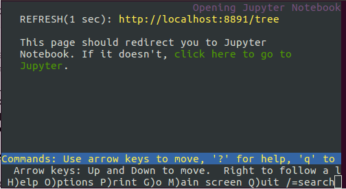
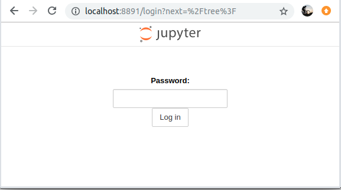

# Jupyter Notebook on Talon HPC

These are the instructions on how to start a **YOUR OWN** Jupyter Notebook server on Talon and how to access it from your computer.

There are two ways you can run Jupyter Notebook, either as an

-   Interactive node job

    -   This is for **SMALL TEST** notebooks that are ran on the visulization login node

!!! warning Interactive notebooks maybe terminated if using too much computing resources, taking too long, or taking too much memory.

-   Compute node job

    -   This is for more larger, intensive jobs
    -   You will run a notebook on a compute node via the SLURM queuing job
    -   This is required for using GPU functions because you need GPU compute nodes

## First time ONLY

-   Execute this step to setup password for your Jupyter Notebook.

-   Login to a Visualization login nodes. Use ONE of the following:

    ``` {.bash}
    $ ssh YOUR_EUID@vis.acs.unt.edu
    ```

-   Load the appropriate module:

    ``` {.bash}
    $ module load python/3.6.5
    ```

-   Type this in your terminal:

    ``` {.bash}
    $ jupyter notebook password
    ```

-   Then enter a password. This will be the password necessary to access Jupyter Notebook. THIS IS NOT YOUR EUID PASSWORD.

    You will have to type twice, for:

    ``` {.bash}
    $ Enter password:
    ```

    And

    ``` {.bash}
    $ Verify password:
    ```

    After you entered the password twice you should see a message:

    ``` {.bash}
    [NotebookPasswordApp] Wrote hashed password to /home/YOUR_EUID/.jupyter/jupyter_notebook_config.json
    ```

    This creates a configuration file jupyter_notebook_config.json related to your password.

<br>

**Now you can run Jupyter Notebook on Talon in a few ways:**

## Run on an interactive node

-   Login to a Visualization login nodes. Use ONE of the following:

        $ ssh YOUR_EUID@vis.acs.unt.edu

-   Load the appropriate module:

        $ module load python/3.6.5

-   Launch Jupyter Notebook:

    Enter the following command in your terminal:

    ``` {.bash}
    $ jupyter notebook
    ```

    This will spawn a Jupyter Notebook terminal window that looks like this: 

    As long as you want to use Jupyter Notebook you need to keep this terminal open.

    If you close this terminal you will lose your Jupyter Notebook session and any unsaved information!

    Keep track of the port that the notebook is running on. in the window you see

    ``` {.bash}
    $ REFRESH(1 sec): http://localhost:8891/tree
    ```

    `8891` is the port number in this case. In your case it can be a different number! That will be YOUR_PORT_NUMBER

-   Forward Jupyter Notebook to your local machine browser

    Now you need to open a new terminal window and use the following command:

        $ ssh -L YOUR_PORT_NUMBER:localhost:YOUR_PORT_NUMBER YOUR_EUDI@vis.acs.unt.edu

    In this example the port number is 8891, so I will use:

        ssh -L 8891:localhost:8891 EUID@vis.acs.unt.edu

    You will replace this number with the one generated in your Jupyter Notebook terminal window.

    This will forward the port of the Jupyter Notebook running on talon to your local machine.

    Double check...

    Now you should have 2 terminals running:

    -   One terminal with the Jupyter Notebook terminal window like in **1.3. Launch Jupyter Notebook**

    

    -   Another terminal that you used to login with like in **1.4 Forward Jupyter Notebook to your local machine browser**:

    ``` {.bash}
    $ ssh -L YOUR_PORT_NUMBER:localhost:YOUR_PORT_NUMBER YOUR_EUDI@vis.acs.unt.edu
    ```

    These 2 terminal are the ones keeping your Jupyter Notebook alive and running on your local machine!

-   Access your Jupyter Notebook:

    Now to access the Jupyter Notebook, open any browser (Chrome,Mozilla etc) and type:

        http://localhost:YOUR_PORT_NUMBER

    In my case, my port number is 8891 so I will have to use:

        http://localhost:8891

    You will see a webpage like this:

    

    This is where you will enter your password that you created when you used

        $ jupyter notebook password

    Now you are inside your Jupyer Notebook on your local machine browser that runs on Talon! Cool!

    This is how mine looks like after login:

    

    I only have bin folder in this image. Yours will be different, you will see all your directories from Talon.

## Run as a job file

-   Login to Talon:

        $ ssh YOUR_EUID@talon3.hpc.unt.edu

-   Create and configure your .job file:

    Now you will need to create a .job file just like a batch submisison job (Check [this](https://github.com/gmihaila/unt_hpc/tree/master/job_batch) out if not familiar with job submissions on Talon) Your .job file should look like this:

    ``` {.bash}
    #!/bin/bash
    #SBATCH -p preproduction
    #SBATCH --qos general
    #SBATCH -N 1
    #SBATCH --ntasks-per-node=16

    module load python/3.6.5
    unset XDG_RUNTIME_DIR
    jupyter notebook --no-browser --ip=0.0.0.0
    ```

    The first 6 lines are configurable to anything you want. See [Talon 3 job submission](https://hpc.unt.edu/userguide#Slurm_tutorials) for more details. You can add/remove resources or functionality to it just like with any job file.

    The part that is very important for Jupyter Notebook in the job file is:

          module load python/3.6.5
          unset XDG_RUNTIME_DIR
          jupyter notebook --no-browser --ip=0.0.0.0

    Once you have the job file ready, you can launch it just like any job file on talon

          $ sbatch YOUR_JOB_FILE.job

    This will launch your job supporting Jupyter Notebooks. We need to find the compute node where the notebooks is running. For this we will use the output file generated by the job file (For example: job_JOB_ID.out) should look like:

        [I 12:33:10.043 NotebookApp] Serving notebooks from local directory: /home/gm0234
        [I 12:33:10.043 NotebookApp] The Jupyter Notebook is running at:
        [I 12:33:10.043 NotebookApp] http://(YOUR_NODE_ADDRESS or 127.0.0.1):YOUR_PORT_NUMBER/
        [I 12:33:10.043 NotebookApp] Use Control-C to stop this server and shut down all kernels (twice to skip confirmation).

    As an example:

        [I 12:33:10.043 NotebookApp] Serving notebooks from local directory: /home/gm0234
        [I 12:33:10.043 NotebookApp] The Jupyter Notebook is running at:
        [I 12:33:10.043 NotebookApp] http://(c32-9-29 or 127.0.0.1):8888/
        [I 12:33:10.043 NotebookApp] Use Control-C to stop this server and shut down all kernels (twice to skip confirmation).

    The part we care about is:

        [I 12:33:10.043 NotebookApp] http://(c32-9-29 or 127.0.0.1):8888/

    More exactly:

        (c32-9-29 or 127.0.0.1):8888/

    From this we know the **YOUR_NODE_ADDRESS**:

        c32-9-29

    And **YOUR_PORT_NUMBER**:

        8888

    Having these two (YOUR_NODE_ADDRESS and YOUR_PORT_NUMBER) we can open a new terminal and login to forward that address to your local machine:

        $ ssh -L YOUR_PORT_NUMBER:YOUR_NODE_ADDRESS:YOUR_PORT_NUMBER YOUR_EUID@vis.acs.unt.edu

    For this example:

        $ ssh -L 8888:c32-9-29:8888 YOUR_EUID@vis.acs.unt.edu

-   Access your Jupyter Notebook:

    Now to access the Jupyter Notebook, open any browser (Chrome,Mozilla etc) and type:

        http://localhost:YOUR_PORT_NUMBER

    In my case, my port number is 8888 so I will have to use:

        http://localhost:8888

    You will see a webpage like this:

    

    This is where you will enter your password that you created when you used

        $ jupyter notebook password

    Now you are inside your Jupyer Notebook on your local machine browser that runs on Talon! Cool!

    This is how mine looks like after login:

    

    I only have bin folder in this image. Yours will be different, you will see all your directories from Talon.

## Notebooks on GPUs (use GPUs on your notebook)

Follow same steps as `Run as a job file` but use a different `.job` file:

``` {.bash}
#!/bin/bash
#SBATCH -J jupyter
#SBATCH -o job_%j.out
#SBATCH -p gpu
#SBATCH --qos general
#SBATCH -N 1
#SBATCH --gres=gpu:4
#SBATCH --mail-type=begin
#SBATCH --mail-user=username@my.unt.edu


module load pytorch/1.0.1

unset XDG_RUNTIME_DIR
jupyter notebook --no-browser --ip=0.0.0.0
```

The first 6 lines are configurable to anything you want. See [Talon 3 job submission](https://hpc.unt.edu/userguide#Slurm_tutorials) for more details. You can add/remove resources or functionality to it just like with any job file.
