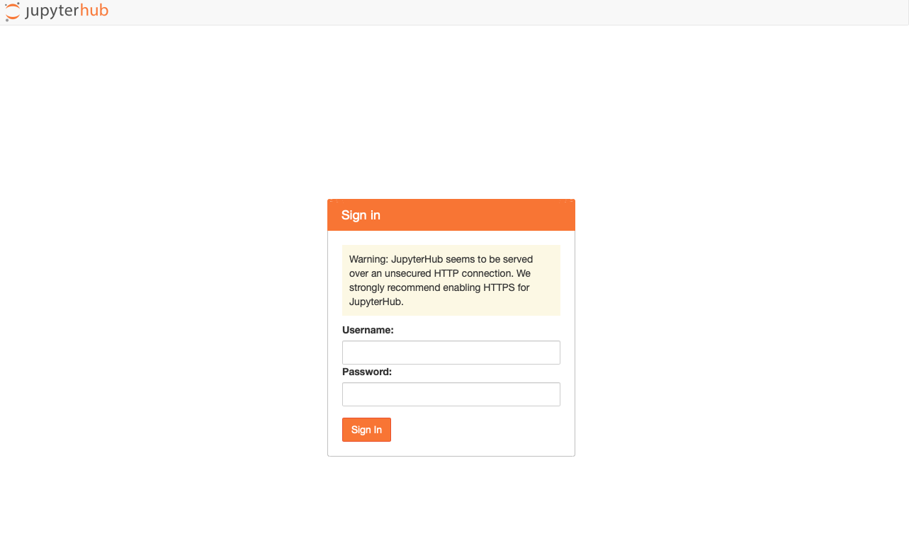
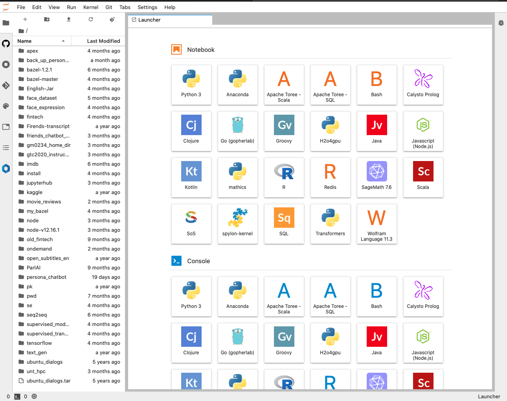
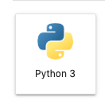
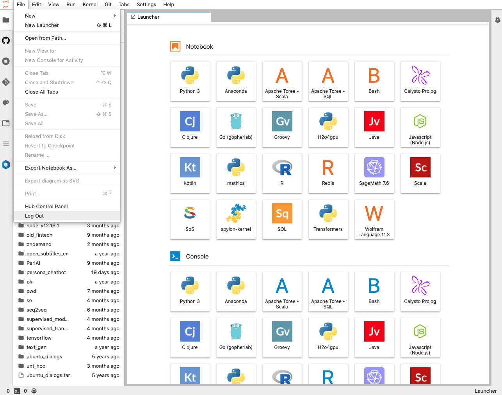

# Using Jupyter Hub on Talon

 

## What is JupyterHub?

[Jupyter Hub](https://jupyter.org/hub) brings the power of notebooks in your browser. It gives users access to computational environments and resources without burdening the users with installation and maintenance tasks. Users - including students, researchers, and data scientists - can get their work done in their own workspaces on shared resources which  is managed efficiently by our Talon HPC team.

JupyterHub runs on Talon UNT HPC, and makes it possible to serve a pre-configured data science environment to any UNT user. It is customizable and scalable, and is suitable for small and large teams, academic courses, and large-scale infrastructure.

## Overview

## Where is JupyterHub running?

JupyterHub is currently running on:

* `vis.acs.unt.edu`
* `vis-04.acs.unt.edu`

## How can I use JupyterHub on Talon?

It is **very** easy to use it!

Here are the steps to follow in order to connect to JupyterHub and start using it:

### Make sure you are connected to the UNT VPN. 

Don't know what/how? [Here](https://hpc.unt.edu/userguide#off_campus) and [here](https://itservices.cas.unt.edu/services/accounts-servers/articles/cisco-anyconnect-mobility-client-vpn) is the info you need!

### Open your favorite browser on your local machine/laptop

Any browser like `Safari, Chrom, Mozzila` will work.

### Choose  JupyterHub Server

#### vis.acs.unt.edu

This is a more recent [Visualization Login Nodes]() that has `V100` GPU.

**Go to [vis.acs.unt.edu:8000](http://vis.acs.unt.edu:8000/hub/login){:target="_blank"}**

#### vis-04.acs.unt.edu

This is a relative older [Visualization Login Nodes]() that has no GPU support.

**Go to [vis-04.acs.unt.edu:8000](http://vis-04.acs.unt.edu:8000/hub/login){:target="_blank"}**

### Login Screen

* **UserName:** Is your **EUID**.
* **Password:** is your Talon account password.

### Loading Screen

Wait for the server to start...

### JupyterHub Launcher

This is where you will see all the apps installed on JupyterHub.
On the left side it will look different for you. This is where you can navigate through your files.

### Start Jupyter Notebook

In order to start a regular Jupyter Notebook in Python use the Python 3 icon app:

Feel free to try out other apps!

## Good Practice

**This will ensure you don't lose any work!**

### Stop server

Make sure to stop your server if you don't need it anymore. 

**File > Hub Control Panel > Stop My Server**

After stopping  the server make sure to log out:
on the top right press **Logout**

### Log Out

This will **not** stop your server!

**File > Log Out**

