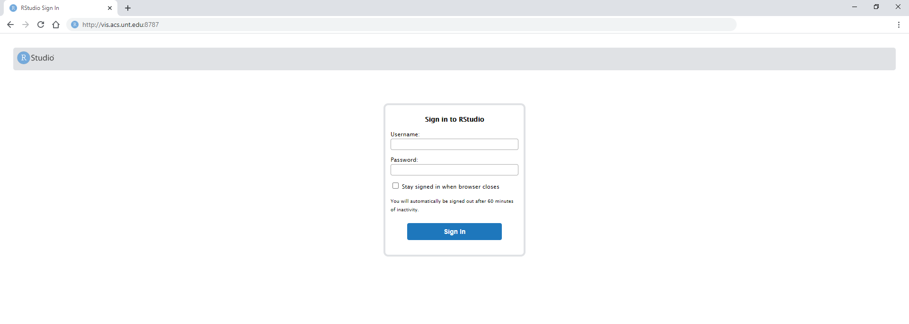

# Using Rstudio on Talon3

## Intro


[RStudio](https://rstudio.com/) is a development IDE for R. This is a great resource for statistical computing and visulization.

Talon3 supports various RStudio servers and is available on the [Visualization nodes](../overview/nodes.md#visualization-login-nodes) of Talon3. 

This means that you can use the RStudio interface to use Talon3!!

## Logging into RStudio

You can access an RStudio interface via a web browser (Chrome, Firefox, Safari) by going to one of Talon3's Visualization nodes

```
http://vis.acs.unt.edu:8787
htpp://vis-06.acs.unt.edu:8787
http://vis-07.acs.unt.edu:8787
```



The login credentials are the same as your Talon3 login/password

Once you login, you have access to RStudio on the Talon3 network. You can execute simple R scripts, transer files, and visualizae data on Talon3.

Since RStudio is running on the Visualization login nodes, any computationally intensive processes are prohibited and can result in expulsion from using UNT HPC resouces. Any large R tasks and commands MUST be submitted as a SLURM batch job.

!!! Tip
	Remember:
	Rsudio access, like SSH access, **MUST** be though the UNT Network.
	This means that if you are trying to access Rsudio outside of UNT, you **MUST** be connected to the UNT VPN network


## Using Rsudio on Talon3

!!! warning
	We are still working on updating our docs!
	Check back for more information!
	Please email SciComp-Support@unt.edu for your questions!
