# Get started on Talon


## How to run a short .py code on HPC (Talon 3)

##  For  `Mac OS/Linux Ubuntu`


### 1. Request an HPC account:

* If you already have one, you are good to go;
* If you don’t have one, please visit https://hpc.unt.edu/account-request ;
* Read carefully and make sure you have all information requested:


* When you are ready, go to https://hpc.unt.edu/user ;
* Login in with your EUID (6 characters: initials+4 digits);
* Fill in the form and wait for our email.

Make sure you are connected to the UNT VPN:

* Instructions can be found here [https://itservices.cas.unt.edu/services/accounts-servers/articles/cisco-anyconnect-mobility-client-vpn](https://itservices.cas.unt.edu/services/accounts-servers/articles/cisco-anyconnect-mobility-client-vpn)


### 2. Open `terminal/command prompt`


### 3. Login to your HPC account by typing: `ssh youraccount@talon3.hpc.unt.edu`, press Enter and you’ll be asked to insert password as bellow:

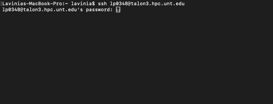


### 4. Fill in with your password, hit Enter and you are in!


### 5. Environment setup

Before running any kind of code, you need to make sure you have the right environment set up. For this, type “module avail” and press Enter. This will give you something like in the following picture where you can check all modules that are available on HPC. 

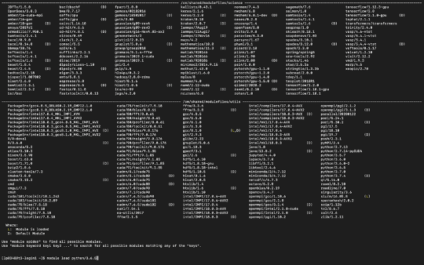

### 6. Lookup module

Look for the module you need. Let’s say you want to run your code using Python 3.6.5. I will type:
module load python/3.6.5 because that’s the name in the list of modules available (see the bottom of the picture above)

### 7. Upload file to Talon

Now that it’s all set up you only need to upload your file containing the python code 

### 8. Access user folder 

You need to access your user folder from HPC. To do that type in:
cd /storage/scratch2/youraccount  press Enter
Hint: if you want to check what subfolders or files you have here you can type ll (small L’s)

### 9. Create project folder

I will create a folder for this project I want to run just to be organized
mkdir functions you can replace word functions with the desired name for your folder
Hint: avoid spaces, don’t give names like “Project 1”, instead you can say “Project_1”

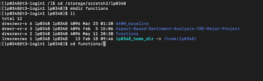

after creating the folder I used the `ll` or `ls` command to check my files and folders from where I am at the moment


### 10. Access your new folder

Access your new folder where the magic will happen:
cd functions/ 

### 11. Copy local to HPC

Now, you want to copy your .py file from local computer on talon in the new folder created. 
For this, open a new terminal window without closing this one.

Use the command cd to access the path of the file you want to transfer. For example:
cd Downloads/
But, if you are not sure where you are at you can type “ls” first:

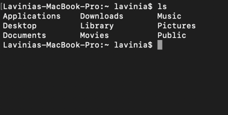

I know my file is in Downloads folder so I’ll go there by typing “cd Downloads/”


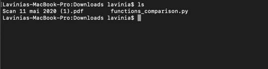

I used again the “ls” command to see all the files in the folder, but what I am interested in is functions_comparison.py

Now, to transfer this file I’ll do the following:
scp functions_comparison.py lp0348@talon3.hpc.unt.edu:/storage/scratch2/lp0348/functions

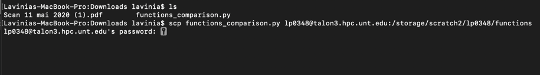

Notice the command is:
scp filename youraccount@talon3.hpc.unt.edu:/the/folder/path/on/talon

After introducing your HPC account password you should see something like:

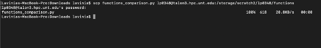


Notice there’s a percentage indicating the transfer progress 

Go back to the previous terminal window you were working on. You can check if the file was transferred:

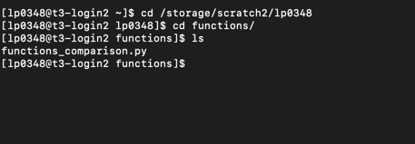

Here it is!

Step 12. Time to create a batch file
What is a batch file? – It is a script containing code running details related to resources you want to allocate  from HPC.
Detailed specifications on each line you can find here: https://github.com/gmihaila/unt_hpc/tree/master/job_batch 
For our example we will use a basic configuration.

```bash
#!/bin/bash 
#SBATCH -J job_name 
#SBATCH -o output_job.o%j ## <- can be left like that (creates a file with the output)
#SBATCH -e error_job.e%j. ## <- can be left like that (creates a file with the errors occurred)
#SBATCH -p public
#SBATCH --qos general
#SBATCH -N 1
#SBATCH -n 1
#SBATCH -C c6320

module load python
python test.py     ## <- name of the .py code file
```

We need to create a file .job where you put the above information. In this tutorial we will use VIM:

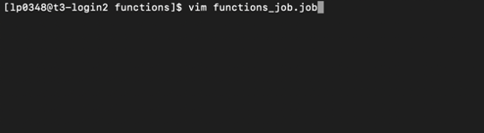

The command: vim name_of_your_job.job

After running this line you should see:

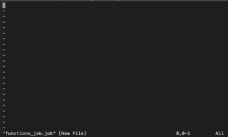

This automatically created the batch file .job and opened it.
In order to insert the content we discussed above, first hit “i” button from the keyboard.
Notice the bottom changed to “—INSERT—”


Now, you can type each line from scratch or you can paste it directly. But, if you are using Linux Ctrl+Shift+V would be the command to paste some content; if you are using Mac Command+V as usual will do the work.

It might be easier for the beginning to write the batch content elsewhere and then just copy-paste the final commands.

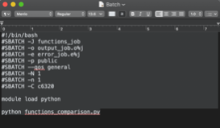


To save and quit the batch file: press “Esc” then type “:wq”

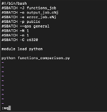

Now “Enter” and will bring you back to the folder.


### 13. Run the job!
The command line is: sbatch job_name.job
You’d probably get the message:

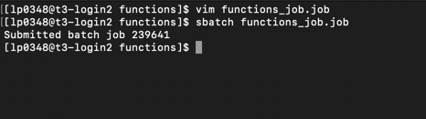

It’s done! You submitted a job that runs the py code on HPC.

If you want to check your jobs you can use the command: squeue -u your_account 

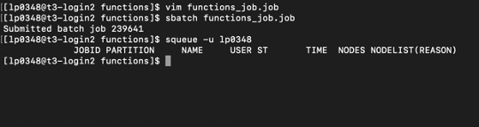


If all your jobs are done already then squeue -u your_account command will give you the above output.


##  From `Windows`
